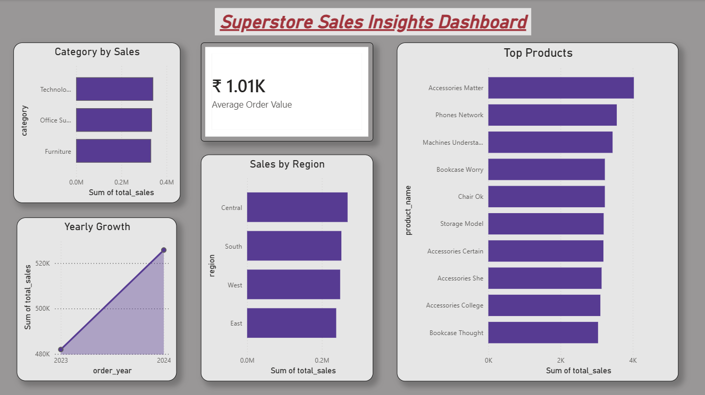

# Superstore Sales Insights Dashboard

A Power BI dashboard project built to analyze Superstore sales performance across regions, categories, products, and years.  
This project uses summary tables created from PostgreSQL and presents the findings in a clean, single-page dashboard.

## Project Overview

This dashboard helps visualize key sales insights from the Superstore dataset.  
It shows average order value, sales by region, top products, yearly growth, and category-wise sales in an easy-to-read format.

## Tools Used

- PostgreSQL
- Power BI Desktop
- Microsoft Excel
- CSV files

## Data Files

The dashboard was built using the following summary tables:

- `avg_order_value.csv`
- `sales_by_region.csv`
- `top_products.csv`
- `yoy_growth.csv`
- `category_sales.csv`

## Dashboard Features

- **Average Order Value** KPI card
- **Sales by Region** bar chart
- **Top Products** bar chart
- **Yearly Growth** line chart
- **Category Sales** bar chart

## Key Insights

- The dashboard gives a quick view of overall business performance.
- It helps identify the best-performing regions.
- It shows which products contribute the most sales.
- It highlights sales growth over time.
- It compares performance across product categories.

## What I Learned

- How to prepare summary data in PostgreSQL
- How to export query results to CSV
- How to build a Power BI dashboard from multiple tables
- How to choose the right visual for each type of data
- How to create a clean portfolio-ready report

## Project Structure

```text
superstore-sales-insights-dashboard/
│
├── README.md
├── Dashboard.pbix
├── screenshots/
│   └── dashboard.png
├── csv_files/
│   ├── avg_order_value.csv
│   ├── sales_by_region.csv
│   ├── top_products.csv
│   ├── yoy_growth.csv
│   └── category_sales.csv
└── sql_queries/
    └── queries.sql
```

## How to Use

1. Open the `Dashboard.pbix` file in Power BI Desktop.
2. Review the visuals and filters.
3. Check the CSV files and SQL queries for the data preparation steps.
4. Use the screenshots for project presentation in GitHub or resume.

## Dashboard Summary

**Superstore Sales Insights Dashboard** is a portfolio project that demonstrates sales analysis, dashboard design, and reporting skills using PostgreSQL and Power BI.

## Screenshot



## Author

Created as part of my data analytics portfolio project.
